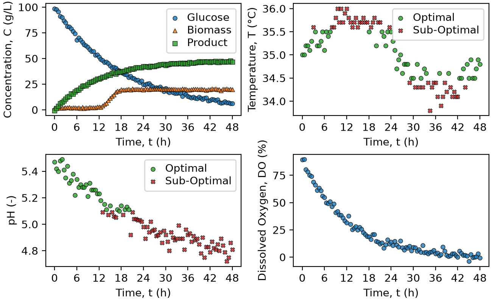

# Fermentation Process Monitor

A Python-based monitoring tool for analyzing fermentation batch data, evaluating operating-condition compliance, and automatically generate process figures and tables.

## Overview

X

## Features

The `BioprocessMonitor` class allows the user to:

X

## Technologies Used

* Python 3.14.7
* NumPy 2.5.2
* Pandas 3.0.5
* Matplotlib 3.11.0

## Code Design

When `main.py` is executed, the fermentation dataset is loaded into a `BioprocessMonitor` object.

Two operating modes are evaluated. Mode A uses an acceptable pH range of 4.8–5.6 and a temperature range of 34.0–36.0 °C. Mode B uses an acceptable pH range of 5.1–5.5 and a temperature range of 34.5–35.5 °C.

For each operating mode, the program extracts each fermentation batch and generates a dashboard containing the major process variables. The program then calculates the percentage of measurements within the acceptable pH and temperature ranges and determines the final product concentration for each batch.

The generated dashboard figures are saved in the `figures` directory, while the summary tables are saved in the `tables` directory.

## Dashboard

The dashboard provides a visual overview of the fermentation process for an individual batch. The top-left subplot shows glucose, biomass, and product concentrations over time. The top-right subplot shows temperature measurements, with measurements inside the acceptable range represented by green circles and measurements outside the range represented by red X markers.

The bottom-left subplot shows pH measurements using the same optimal and sub-optimal classification. The bottom-right subplot shows dissolved oxygen over time. All subplots use time in hours on the x-axis with a consistent 6-hour major tick spacing.

## Summary Table

|batch_id|ph_optimal_percent|temperature_optimal_percent|C_product_g_L^-1_final|
|--------|------------------|---------------------------|----------------------|
|1       |93.81             |97.94                      |46.5                  |
|2       |96.69             |97.52                      |50.8                  |
|3       |95.89             |93.15                      |44.6                  |
|4       |100               |96.47                      |48.6                  |
|5       |48.62             |99.08                      |24.7                  |

The summary table provides a batch-level overview of fermentation performance. For each batch, it reports the percentage of measurements within the acceptable pH range, the percentage within the acceptable temperature range, and the final product concentration.

The table allows the operating performance of different batches to be compared quantitatively.
